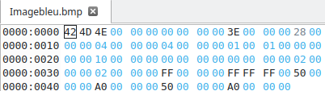
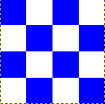
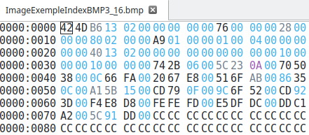
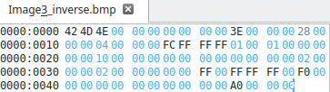

# SAE SYSTEME :    

## A0 :  

Les 14 premiers octets font partie de l'entête du fichier. Nous avons donc :  
- **Les 2 premiers** sont le type de fichier : BM  
- **Les 4 octets suivants** indiquent la taille totale du fichier en octets ; ici, le fichier compte **816026 octets**  
- **Les 4 octets d'après** sont à 0 car ils ne sont pas utiles pour le moment  
- **Les 4 derniers octets** de cette première partie renvoient à la position du premier pixel de l'image (ici, il se situe au **27ème octet**, à l'adresse **0x1A**)  

Les douze octets suivants représentent le 2ème entête d'image, le **BITMAPCOREHEADER** :  
- **Les 4 premiers octets** donnent la taille de cet entête  
- **Les 2 octets suivants** indiquent la largeur de l'image  
- **Les 2 octets suivants** eux indiquent la hauteur  
- **Les 2 octets suivants** donnent le plan de couleurs  
- **Les 2 derniers octets** représentent le nombre de bits pour un pixel  

`display ImageExemple.bmp`

erreur : 

`display-im6.q16: length and filesize do not match 'ImageExemple.bmp' @error/bmp.c/ReadBMPImage/958.`

Explications sur le problème
Le format BMP inclut des métadonnées au début du fichier qui décrivent des propriétés telles que :

Si l'en-tête contient une taille incorrecte, ImageMagick considère cela comme une anomalie et émet une erreur. Le programme display peut encore afficher l'image car il tente de lire les données disponibles, mais l'erreur est affichée pour signaler le problème.
ici  c’est une erreur de taille  de fichier car la taille ne corresponds pas a la vrai taille on peut le voir en mettant la commande ls -l (816026) or si l’on compte manuellement cela donne (816025) il y a donc une anomalie en reglant ce probleme sur octeta on peut lancer l’image sans bug.

## A1 :

Pour crée l'image j'ai recopier l'entete du fichier BMP et j'ai simplement modifié la taille de l'image en changeant les valeurs des octets 19 et 20.
par la suite pour les couleurs j'ai utilisé un site qui permet de convertir les couleurs en hexadécimal pour les mettre dans le fichier BMP. ce qui ma donner pour le rouge : 0x0000FF et pour le blanc : 0xFFFFFF. il fallait bien sure les mettre dans l'ordre inverse car le BMP est en little endian.
voici donc mon fichier BMP sur okteta :
 

et voici le rendu de l'image :

## A.2

pour modifier l'image j'ai recopier exactement la meme entete que l'image précédente et j'ai simplement modifié les couleurs j'ai donc convertis les couleurs demandé tel que 
- le rouge : 0x0000FF
- le vert : 0x00FF00 
- le bleu : 0xFF0000 
- le cyan : 0xFFFF00 
- le bleu céruléen : 0xE89D0F
- le mangenta : 0xFF00FF
- le blanc : 0xFFFFFF 

ce qui ma donner le fichier BMP suivant :

et voici le rendu de l'image :

## A.3

En effectuant la conversion au format Windows NT 3.1x, je remarque que l'image reste visuellement identique. En examinant les données avec Okteta, on constate que l'en-tête de l'image est passé de 12 octets à 40 octets, augmentant ainsi de 28 octets. 
Les couleurs demeurent inchangées et sont toujours codées sur 3 octets. Il ne semble pas y avoir eu de compression de l'image non plus. Enfin, le codage de l'image reste le même, à l'exception du fait qu'il commence à l'octet 54 au lieu de 26.

## A.4

Après la conversion de l'image2 grâce à `>convert Image1.bmp -colors 2 bmp3:Image2.bmp`  
L'image ne change toujours pas visuellement, mais en examinant les données avec Okteta, on peut voir :

- Grâce à la question A.1, on sait que le nombre de bits par pixel est à l'adresse **0x1C** en **BITMAPCOREHEADER** et qu'à l'adresse **0x1C**, on a `01`, donc on a 1 bit par pixel.  
- Les données des pixels sont stockées sur **16 octets**.  
- Il n'y a pas de compression de l'image.  
- La palette de couleurs est sur **4 octets** : 3 pour le rouge, le vert et le bleu, et 1 réservé.  
- Le nombre de couleurs est de **2**, le blanc et le rouge. On peut le voir à :  
    - L'adresse **0x36**, où l'on peut voir le rouge.  
    - L'adresse **0x3A**, où l'on peut voir le blanc, qui sont codés en **little-endian**, bien sûr.  
- Le codage des pixels a changé, car ici, on définit la couleur non pas par ses composantes, mais par sa position dans la palette de couleurs.  
    - Pour le blanc, c'est sur **32 bits**, soit `00 00 00 00`.  
    - Pour le rouge, c'est également sur **32 bits**, soit `01 00 00 00`.

- Pour obtenir la même image en **bleu et blanc**, il nous suffit de changer le rouge de la palette, qui passe de `00 00 FF 00` à `FF 00 00`. Ainsi, les pointeurs restent les mêmes, mais les couleurs changent, ce qui nous donne l'image suivante :

      
      

- Pour inverser l'image, il suffit d'inverser les pixels :  
    Là où il y a un **A**, il faut mettre l'inverse, soit un **5**.  
    Là où il y a un **5**, il faut mettre un **A**.  
- Ce qui nous donne :

      
      

- Pour obtenir cette image :

    

    Pour obtenir **Image3.bmp**, il suffit de reprendre **Image2.bmp** et de faire correspondre les pixels avec la bonne couleur.

    Donc, il faut :  
    - Mettre `F0 00` à la place de `50 00` à l'adresse **0x3E**.  
    - Mettre `00 00` à la place de `A0 00` à l'adresse **0x42**.  
    - Mettre `00 00` à la place de `50 00` à l'adresse **0x46**.  

    

---

- Après avoir exécuté la commande :  
    `convert ImageExemple.bmp -colors 16 bmp3:ImageExempleIndexBMP3_16.bmp`  
    On obtient la même image que **ImageExemple.bmp**.  

    Mais voici l'image dans Okteta :

    

- On peut voir que le **nombre de couleurs dans la palette** se trouve à l'adresse **0x2E**, soit **16 couleurs**.

- En analysant le fichier, on cherche la couleur blanche (`FF FF FF 00`).  
  Cependant, elle n'est pas présente directement, bien que la couleur blanche soit visible dans l'image.  
  Cela signifie qu'il s'agit probablement d'une **nuance de blanc**. En cherchant la nuance la plus proche, on trouve **FE FE FD 00** à l'adresse **0x66**, qui est donc un blanc proche, mais pas un vrai blanc.

- De plus, en utilisant ce site : [Convertisseur de couleur RGB-HSL-Hexa](http://web-color.aliasdmc.fr/couleurs-html/convertisseur-couleur-rgb-hsl-hexa.html?#bloc-screen-resultat),  
  et en entrant la couleur `FEFEFD`, on obtient bien un **blanc proche** du blanc pur, indifférenciable à l'œil nu.

- Le tableau de pixel commence a l'adresse **0x76**. qui commence par `CC CC CC CC`

- Puisque les pixels commence en bas a gauche on peut modifier les premiers pixels pour obtenir l'image mais avec une ligne de bleu en bas 

    donc en mettant par exemple une ligne de `00` a l'adresse **0x76** on obtient l'image suivante : 

    
     
    avec cette modification on peut voir que l'image a bien une ligne de bleu en bas. 

    

- en utilisant la commande : `convert ImageExemple.bmp -colors 4 bmp3:ImageExempleIndexBMP3_4.bmp`

    
    On obtient l'image suivante :

    

    On peut donc voir que l'image est bien la même que l'image de base mais les couleurs sont différentes : il n'y a plus d'orange, mais un gris à la place, et en général, les couleurs sont plus sombres.

- En regardant l'image dans Okteta, on peut voir que l'image a bien changé.

    

    En comparaison avec l'image de base :

    

## A.5

- Pour changer la valeur de la hauteur de 4 à -4, il suffit de changer la valeur des octets **0x16** de `04 00 00 00` à `FC FF FF FF`. Cela nous donne l'image suivante :

    

    Avec ce code dans Okteta :

    

- Pour inverser l'imageExemple, il suffit de changer les valeurs des hauteurs, donc de passer de `A9 01 00 00` à `57 FE FF FF`. Cela nous donne l'image suivante :

    

    Avec ce code dans Okteta :

    

## A.6

- Avec la commande `convert Image1.bmp -colors 2 -compress RLE bmp3:Image4.bmp`, on obtient la même image mais le poids a changé, passant de 102 octets à 1120 octets.

    Donc la compression RLE augmente le poids de l'image, mais permet de compresser l'image.

- Le début de l'image est donné à l'adresse **0x0A**, qui est donc `36 04 00 00`, donc l'image commence à l'adresse **0x436**.

    

## A.7

- Avec la commande `convert Image3.bmp -colors 2 -compress RLE bmp3:Image5.bmp`, le poids de l'image est de 1102 octets. Il est donc légèrement plus léger que l'image 4. Cela est dû au fait que l'image 1 fait 102 octets et l'image 3 fait 78 octets, donc il y a un écart de 24 octets entre les deux images, ce qui est le même écart entre l'image 4 et l'image 5.

- Les données d'image sont compressées de cette facon :
     - `0x03 0x01` signifie 3 pixels de la couleur indexée par 1 donc par exemple blanc.
     - `0x00 0x00` marque la fin d'une ligne.
     - `0x00 0x01` marque la fin de l'image.

## A.8

En modifiant les valeurs et en recodant tout les pixels a partir du debut de l'image on ecris donc Ox02 Ox01 Ox01 Ox00 Ox01 Ox00 Ox00 Ox00 donc Cela code la première ligne en mettant deux pixels blancs, puis un pixel rouge, puis un pixel blanc, et termine la ligne. Ainsi, on obtient l'image suivante :

Avec le code correspondant dans Okteta :

# A.9

Pour créer l'image 7, il y a un problème : pour le moment, nous n'avons que deux couleurs (rouge et blanc). Il faut donc modifier la palette pour ajouter les couleurs vert et bleu. On peut les ajouter à la suite de la palette existante avec les valeurs suivantes :

- Vert : `0x00 0xFF 0x00 0x00`
- Bleu : `0xFF 0x00 0x00 0x00`

Après avoir modifié la palette, on modifie les pixels de la même manière que précédemment. On obtient alors l'image suivante :

Avec le code correspondant dans Okteta (en-tête) :

Et les pixels suivants :

# A.10

Pour créer l'image 8, on peut simplement modifier les pixels de l'image 7 pour obtenir l'image suivante :

Avec le code correspondant dans Okteta :

# B.1

