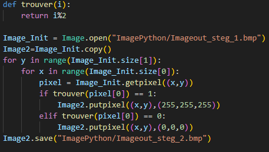

# Rapport de SAE Image

## A.0

Les 14 premiers octets du fichier _ImageExemple.bmp_ que l'on visualise sur Oktetat correspondent à l'entête de l'image, c'est-à-dire ses informations essentielles :

- Les 2 premiers octets définissent le format du fichier (ici, _BM_) : chaque octet représente une lettre en Ascii

- Les 4 octets suivants indiquent la taille totale du fichier en octets ; ici, le fichier compte 816026 octets (soit _C739A_ en hexadécimal)

- Les 4 octets d'après sont à 0, ils sont dits "réservés"

- Les 4 derniers octets de cette première partie renvoient à la position du premier pixel de l'image (ici, il se situe au 27ème octet, à l'adresse 0x1A)

Les douze octets suivants représentent le 2ème entête d'image, le _BITMAPCOREHEADER_ :

- Les 4 premiers octets donnent la taille de cet entête (12, ou OC en hexadécimal, qui est la taille standard de ce type)

- Les 2 octets suivants indiquent la largeur de l'image en pixels, ici de 640

- Les 2 octets d'après indiquent la hauteur de l'image, toujours en pixels, et ici de 425

- Les 2 prochains donnent le nombre de plans de couleurs, généralement toujours à 1

- Enfin, les 2 derniers octets représentent le nombre de bits utilisés pour représenter un pixel (ici, il correspond à 24 : cela signifie qu'il faudra un octet pour le rouge, un pour le vert et un pour le bleu)

Les valeurs suivantes correspondent aux pixels de l'image. Elles vont de 0 à 255, car il s'agit d'octets, et se lisent pas groupe de trois, comme vu précédemment.
L'ordre de lecture sera bleu-vert-rouge, car les machines codent en little endian et inversent donc les octets.

L'erreur constatée au lancement du fichier avec la commande _display_ vient du fait que la taille du fichier ne correspond pas à sa taille réelle. En effet, _ImageExemple.bmp_ est un fichier de 816026 octets, et la valeur présente à l'adresse 0x02 correspond à la valeur 816025. Il faut donc la corriger en ajoutant 1 à la valeur initialement présente sur le fichier, ce qui donne C739A.

## A.1

_Image0.bmp_ reprend le même entête que l'image précédente, avec pour seules différences la taille du fichier (74 octets, 4A en héxadécimal) et les dimensions (4 pixels de largeur et de hauteur).

Les valeurs d'après sont les 16 pixels de l'image. Le blanc est représenté par les octets _FF FF FF_, car il est issu du mélange des 3 couleurs à leur maximum, et le rouge, par _00 00 FF_ ; on est ici sur le rouge primaire.

## A.2

_Imagetest.bmp_ a exactement le même entête, donc les 26 mêmes premiers octets, que _Image0.bmp_, seules les couleurs de certains pixels changent.

## A.3

En effectuant la conversion en format Windows NT 3.1x, l'entête d'image passe de 12 à 40 octets.
Le fichier _Image1.bmp_ gagne 28 octets par rapport à _Image0.bmp_, mais reste visuellement exactement la même.

En comparant _Image0.bmp_ et _Image1.bmp_ sur l'éditeur Okteta, on arrive à repérer les différences entre ces deux images.

La taille des pixels reste la même (deux octets) et la valeur est identique sur les 2 fichiers : dans les deux cas, il y a 24 bits par pixel, pour trois octets par couleur (BVR).

Il ne semble pas il y avoir de compression sur cette nouvelle version de l'image puisqu'on y remarque de nombreux 0 superflus.

Le codage des pixels ne change pas d'un fichier à l'autre, car comme dit précédemment, leur taille ne bouge pas.

## A.4

Le fichier _Image2.bmp_ est créé à l'exécution de la commande _convert Image1.bmp -colors 2 bmp3:Image2.bmp_ :

- Il y a un seul bit par pixel car on retrouve la valeur 1 à l'adresse 0x1C.

  

- Les données pixels tiennent sur seize octets. Cette valeur est visible à l'adresse 0x22.

  

- Aucune compression n'est utilisée comme le prouve la valeur 0 à l'adresse 0x1E.

- Les couleurs de la palette sont codées sur 4 octets. Elle est située à la suite de l'entête du bitmap. Parmi ces 4 octets, trois sont utilisés pour les couleurs primaires (bleu, vert et rouge) et l'octet restant est réservé.

  

- Comme on peut le remarquer dans la capture d'écran ci-dessus, il y a deux groupes de 4 octets qui représentent deux couleurs dans la palette : le rouge (00 FF 00 00) et le blanc (FF FF FF 00).

- Le codage des pixels a nettement changé. Dans ce fichier, on définit un pixel comme un pointeur sur une couleur de la palette. Par exemple, le premier pixel a la valeur 0 pour indiquer qu'il est de la couleur d'indice 0 (le rouge) de la palette précédemment définie. Le 2ème pixel a la valeur 1 pour indiquer qu'il est de couleur blanche, la couleur d'indice 1 de la palette de couleur. On remarque qu'ici aussi, les indices commencent à 0 et non à 1.

- Le fichier _ImageBleue.bmp_ est obtenu en changeant le code du rouge de la palette en code pour le bleu. Les pointeurs des pixels restent les mêmes.

  

- L'inversion du damier se fait en échangeant les pointeurs. Les pixels pointant sur la couleur bleue sont réassignés à la couleur blanche et inversement.

  

- Pour obtenir _Image3.bmp_, il suffit de reprendre _Image2.bmp_ et de faire correspondre les pixels avec la bonne couleur. Pour créer les lignes, il suffit de diviser les pixels en groupes de 4 et de changer la couleur d'un groupe entier.

  
  

- Le nombre de couleurs présentes dans la palette est indiqué à l'adresse 0x2E.

  

- La couleur dominante "blanc" utilisée est référencée à l'adresse 0x66. Elle a pour valeurs : 254 de bleu, 254 de vert et 253 de rouge. Ce n'est donc pas un blanc pur car les valeurs ne sont pas à 255.

  

- Le tableau de pixel commence à l'adresse 0x76 : cette information se trouve  à l'adresse 0x0A.

  

- En diminuant le nombre de couleurs dans la palette, certaines couleurs changent (il n'y a désormais plus d'orange mais un gris foncé à la place). L'image est globalement plus sombre et le code hexadécimal est altéré.

  
  

## A.5
 
- Quand la hauteur du fichier _Image3.bmp_ est modifiée, l'image est inversée. Le premier onglet de l'image ci-dessous correspond au fichier avant modifications, et le 2ème au fichier après modifications ; les différences sont encadrés.

  

- Afin d'obtenir _ImageExempleBMP3_16.bmp_ à l'envers, je change la valeur de la hauteur (000001A9) pour mettre son opposé (en C2 : FFFFFE57).

  
  

## A.6

- Le nouveau fichier _Image4.bmp_ a un poids de 1120 octets. Cette taille est due à la compression utilisée, qui n'est pas très optimisée pour ce type d'image.

- Le début des pixels est situé à l'adresse 0x436 (donnée à l'adresse 0x0A).

  

- Les pixels sont modélisés par un nombre d'itérations et un indice de couleur, comme sur une image basique avec une palette (un octet pour chaque). Ainsi, puisqu'à l'adresse 0x436 (premier octet des données pixels visibles ci-dessus) est présente la valeur 01, et à l'octet suivant la valeur 00, le premier pixel ne se répète qu'une fois (c'est-à-dire qu'il est différent de son voisin) et est de couleur rouge (la couleur d'indice 0 sur la palette de couleurs est toujours le rouge). Par la suite, à l'adresse 0x438, est présente la valeur 01, et 01 à l'adresse 0x439. Le 2ème pixel est donc de la 2ème couleur de la palette de couleur (le blanc), et ne se répète que sur ce 2ème pixel, pas sur le 3ème. Une paire d'octets côte à côte valant tous les deux 00 (comme on peut en trouver à l'adresse 0x43E) désigne une fin de ligne.

  

## A.7

- Le nouveau fichier _Image5.bmp_ a un poids de 1102 octets. Cette taille est légèrement inférieure à celle de _Image4.bmp_ car les pixels sont placés différemment, donc le code diffère.

- Le code des pixels commence aussi à 0x436 et ne s'étend que sur 24 octets (en opposition avec les 42 octets d'_Image4.bmp_). Les couleurs de la palette sont le rouge et le blanc. Le code des pixels désigne successivement :
  - 4 pixels blancs et une fin de ligne (de l'adresse 0x436 à 0x439),
  - 4 pixels rouges et une fin de ligne (de l'adresse 0x43A à 0x43D),
  - 4 pixels rouges et une fin de ligne de nouveau (de l'adresse 0x43E à 0x441),
  - 1 pixel blanc, 1 pixel rouge, 1 pixel blanc, 1 pixel rouge et une fin de ligne (de l'adresse 0x442 à 0x44B).

  Enfin, le codage des pixels s'achève comme le montrent les deux octets 00 01.

  

## B.1

## B.2

## B.3

## B.4

## B.5 

#### Codage de l'image

#### Décodage de l'image

